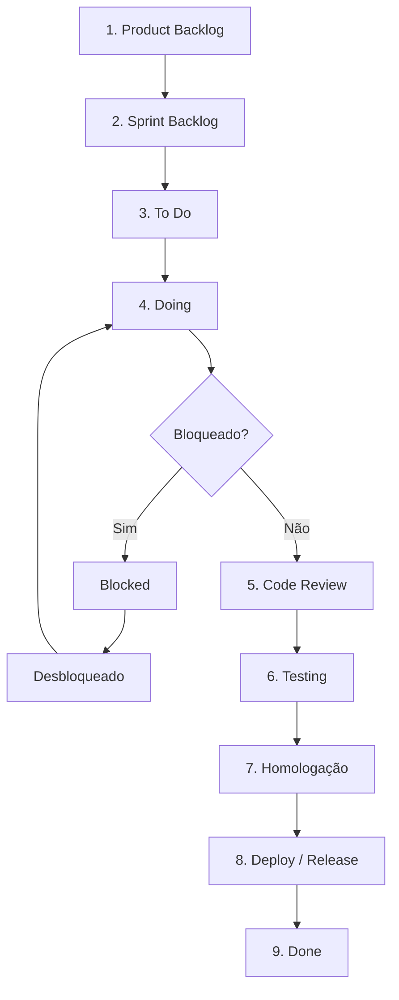

```mermaid
flowchart TD
    A["1. Product Backlog"] --> B["2. Sprint Backlog"]
    B --> C["3. To Do"]
    C --> D["4. Doing"]
    D --> E{"Bloqueado?"}

    E -- Sim --> F["Blocked"]
    F --> G["Desbloqueado"]
    G --> D

    E -- Não --> H["5. Code Review"]
    H --> I["6. Testing"]
    I --> J["7. Homologação"]
    J --> K["8. Deploy / Release"]
    K --> L["9. Done"]
```

