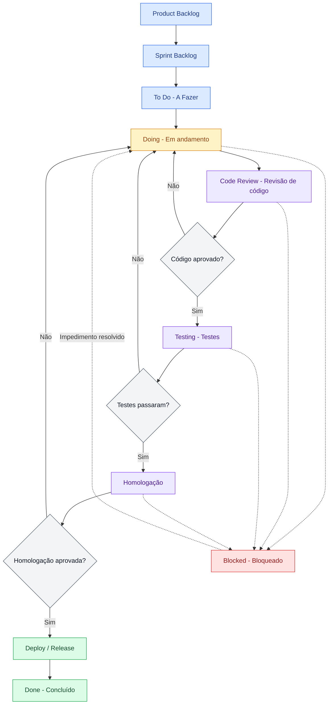

```mermaid
flowchart TD
    A["Product Backlog"] --> B["Sprint Backlog"]
    B --> C["To Do - A Fazer"]
    C --> D["Doing - Em andamento"]
    D --> E["Code Review - Revisão de código"]
    E --> F{"Código aprovado?"}

    F -- Não --> D
    F -- Sim --> G["Testing - Testes"]
    G --> H{"Testes passaram?"}

    H -- Não --> D
    H -- Sim --> I["Homologação"]
    I --> J{"Homologação aprovada?"}

    J -- Não --> D
    J -- Sim --> K["Deploy / Release"]
    K --> L["Done - Concluído"]

    D -.-> M["Blocked - Bloqueado"]
    E -.-> M
    G -.-> M
    I -.-> M
    M -. "Impedimento resolvido" .-> D

    classDef backlog fill:#DBEAFE,stroke:#2563EB,color:#1E3A8A
    classDef progress fill:#FEF3C7,stroke:#D97706,color:#92400E
    classDef review fill:#EDE9FE,stroke:#7C3AED,color:#4C1D95
    classDef success fill:#DCFCE7,stroke:#16A34A,color:#14532D
    classDef blocked fill:#FEE2E2,stroke:#DC2626,color:#991B1B
    classDef decision fill:#F3F4F6,stroke:#4B5563,color:#111827

    class A,B,C backlog
    class D progress
    class E,G,I review
    class K,L success
    class M blocked
    class F,H,J decision
```
