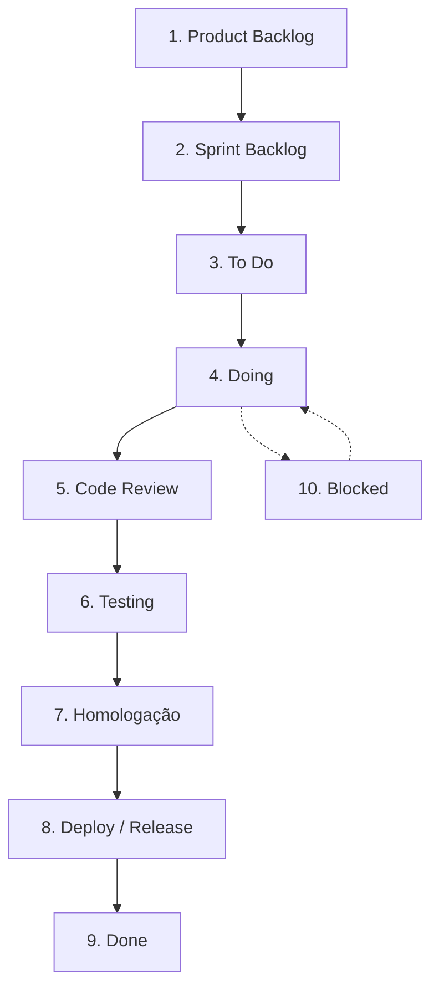

```mermaid
flowchart TD
    A["1. Product Backlog"] --> B["2. Sprint Backlog"]
    B --> C["3. To Do"]
    C --> D["4. Doing"]
    D --> E["5. Code Review"]
    E --> F["6. Testing"]
    F --> G["7. Homologação"]
    G --> H["8. Deploy / Release"]
    H --> I["9. Done"]
    D -.-> J["10. Blocked"]
    J -.-> D
```
